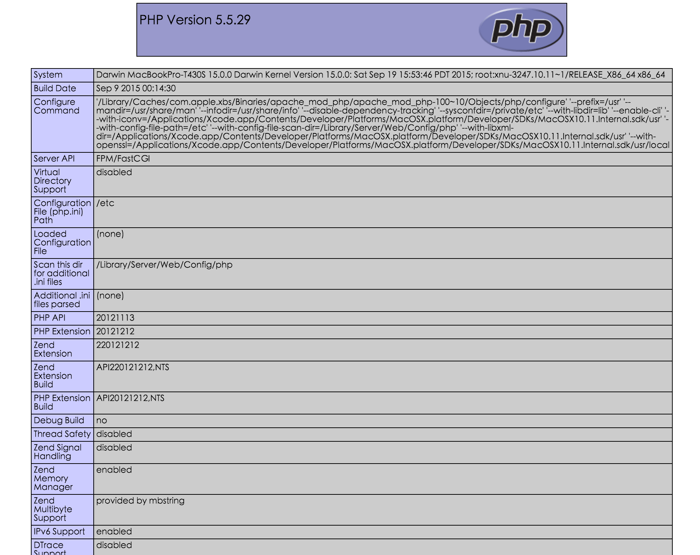

# 在OS X上搭建Nginx＋PHP＋MySQL的Web开发环境

* OS X: EI Capitan 10.11.1   

## 1.安装homebrew
1. 打开终端Terminal。
2. 在命令行中输入如下命令安装homebrew  
  `ruby -e "$(curl -fsSL https://raw.githubusercontent.com/Homebrew/install/master/install)"`  
  根据提示和向导，按Enter键和输入管理密码，homebrew官方提供的脚本会自动将homebrew安装到系统中。  
  如果出现`curl: (35) Server aborted the SSL handshake`错误提示，那么很可能是安装源的网站被墙了，只能先翻墙再安装。
3. 如果中途失败，再次运行2中的命令，出现如下错误
  `It appears Homebrew is already installed. If your intent is to reinstall you
should do the following before running this installer again:
    ruby -e "$(curl -fsSL https://raw.githubusercontent.com/Homebrew/install/master/uninstall)"`  
    运行`rm -fr /usr/local/.git`，删掉缓存即可重新安装。
4. 安装完成后，运行`brew update`，更新安装包的最新信息。
5. 到此，homebrew就安装成功了。brew默认把下载的程序缓存在`/Library/Caches/Homebrew`目录，可以手动清理。
brew的用法类似于Red Hat Linux的yum，常用用法如下：  

    brew search xxxx #查找软件包   
brew install xxxx #安装软件包   
brew list #列出已安装的软件包   
brew remove xxxx #删除软件包   
brew info xxxx #查看软件包信息   
brew deps xxxx #列出软件包的依赖关系  
brew update #更新brew  
brew outdated #列出过时的软件包，已安装但不是最新版  
brew upgrade #更新全部过时的软件包  
brew upgrade xxxx #更新指定的软件包  

## 2.安装Nginx
1. 使用`brew install nginx`安装Nginx，当前的稳定版本为1.8.0。
默认Nginx的配置文件安装在`/usr/local/etc/nginx`, 程序文件安装在`/usr/local/bin`, Web目录安装在`/usr/local/var/www`。

2. 修改`/usr/local/etc/nginx/nginx.conf`文件,改为如下内容   
  user  nobody;   
  worker_processes  1;  

  error_log  /usr/local/var/log/nginx/error.log;  
  \#error_log  logs/error.log  notice;  
  \#error_log  logs/error.log  info;  

  pid        /usr/local/var/run/nginx/nginx.pid;

  events {  
      worker_connections  1024;  
  }

  http {  
      include       mime.types;  
      default_type  application/octet-stream;  
      log_format  main  '$remote_addr - $remote_user [$time_local] "$request" '
      '$status $body_bytes_sent "$http_referer" '
      '"$http_user_agent" "$http_x_forwarded_for"';  

      #access_log  /usr/local/var/log/nginx/access.log  main;

      sendfile        on;
      #tcp_nopush     on;

      #keepalive_timeout  0;
      keepalive_timeout  65;

      gzip  on;

      \# another virtual host using mix of IP-, name-, and port-based configuration
      \#
      \#server {
      \#    listen       8000;
      \#    listen       somename:8080;
      \#    server_name  somename  alias  another.alias;

      \#    location / {  
      \#        root   html;  
      \#        index  index.html index.htm;  
      \#    }  
      \#}

      \# HTTPS server  
      \#  
      \#server {  
      \#    listen       443 ssl;  
      \#    server_name  localhost;  

      \#    ssl_certificate      cert.pem;  
      \#    ssl_certificate_key  cert.key;  

      \#    ssl_session_cache    shared:SSL:1m;  
      \#    ssl_session_timeout  5m;  

      \#    ssl_ciphers  HIGH:!aNULL:!MD5;  
      \#    ssl_prefer_server_ciphers  on;  

      \#    location / {  
      \#        root   html;  
      \#        index  index.html index.htm;  
      \#    }  
      \#}  

      include servers/\*.conf;
  }  

3. 在`/usr/local/etc/nginx/servers`目录下新建`default.conf`配置文件，修改内容为以下：   
    server {   
    listen       80;  
    server_name  localhost;

    charset utf-8;

    access_log  /usr/local/var/log/nginx/default.access.log  main;  

    location / {  
    root   /usr/local/var/www;  
    index  index.html index.htm;  
    }  

    \#error_page  404              /404.html;

    \# redirect server error pages to the static page /50x.html  
    \#  
    error_page   500 502 503 504  /50x.html;  
    location = /50x.html {  
    root   html;  
    }  

    \# proxy the PHP scripts to Apache listening on 127.0.0.1:80  
    \#  
    \#location ~ \\.php$ {  
    \#    proxy_pass   http://127.0.0.1;  
    \#}  

    \# pass the PHP scripts to FastCGI server listening on 127.0.0.1:9000  
    \#  
    \#location ~ \\.php$ {  
    \#    root           html;  
    \#    fastcgi_pass   127.0.0.1:9000;  
    \#    fastcgi_index  index.php;  
    \#    fastcgi_param  SCRIPT_FILENAME  /scripts$fastcgi_script_name;  
    \#    include        fastcgi_params;  
    \#}  

    \# deny access to .htaccess files, if Apache's document root
    \# concurs with nginx's one  
    \#  
    location ~ /\.ht {  
    deny  all;  
    }  
}

4. 在终端中使用`sudo nginx`命令启动nginx服务。这时打开本机浏览器，输入127.0.0.1的回环地址，应该就可以看到`Welcome to nginx!`的欢迎页面了。   
表示nginx已经安装成功。   

5. 其他Nginx命令   
nginx -t #测试nginx配置文件   
nginx -s reload #重载nginx服务   
nginx -s stop #停止nginx服务  
nginx -v #查看版本信息  
nginx -V #查看版本信息和编译信息

## 3.配置PHP-FPM
1. OS X自带PHP和PHP-FPM,当前版本是5.5.29。复制一份php-fpm的配置文件`sudo cp /etc/php-fpm.conf.default /etc/php-fpm.conf`。  
2. 编辑/etc/php-fpm.conf,修改第25行为`pid = /usr/local/var/run/php-fpm.pid`，修改第32行为`error_log = /usr/local/var/log/php-fpm.log`。
3. 使用`sudo php-fpm`启动php-fpm。
4. 修改`/usr/local/etc/nginx/servers/default.conf`文件内容为   
    server {  
      listen       80;  
      server_name  localhost;  

      charset utf-8;

      access_log  /usr/local/var/log/nginx/default.access.log  main;   
      root   /usr/local/var/www;

      \# proxy the PHP scripts to Apache listening on 127.0.0.1:80  
      \#  
      \#location ~ \\.php$ {  
      \#    proxy_pass   http://127.0.0.1;  
      \#}  

      \# pass the PHP scripts to FastCGI server listening on 127.0.0.1:9000  
      \#  
      location ~ \\.php$ {  
      fastcgi_pass   127.0.0.1:9000;  
      fastcgi_index  /index.php;  
      fastcgi_param  SCRIPT_FILENAME  $document_root$fastcgi_script_name;  
      include        fastcgi_params;  
      }  

      \# deny access to .htaccess files, if Apache's document root
      \# concurs with nginx's one
      \#  
      location ~ /\\.ht {  
      deny  all;  
      }  
    }   
5. 使用`sudo nginx -s reload`命令重启nginx服务。
6. 在/usr/local/var/www目录下新建info.php文件，修改该文件内容为：
`<?php
	echo phpinfo();
?>`
7. 使用浏览器输入`http://127.0.0.1/info.php`，这时应该看到phpinfo()函数成功执行返回的页面了，表示nginx和php-fpm成功配对了。

## 4.安装MySQL
1. 使用`brew install mysql`安装MySQL服务，当前的brew提供的版本是v5.7.9，安装过程中会自动初始化MySQL所需的数据库。
2. 使用`mysql.server start`命令启动MySQL服务；使用`mysql.server stop`命令停止MySQL服务。
3. 默认安装的root用户密码为空，启动服务后使用`mysql -uroot`测试root用户和系统服务。

## 5.安装Composer
1. 使用`brew install homebrew/php/composer`命令安装composer，安装后运行`composer`命令就会看到其logo。

## 6.安装mcryt和php-mcrypt扩展
1. 使用`brew install homebrew/php/php55-mcrypt`命令安装扩展，brew会自动安装依赖关系。

## 7.安装Laravel
1. 使用`composer create-project laravel/laravel --prefer-dist`命令下载Laravel的源文件，加上--prefer-dist参数当前会下载5.1.11版到当前目录。
2. 将下载到的laravel目录复制到`/usr/local/var/`下；
3. 给laravel的storage目录增加写权限`sudo chmod a+w /usr/local/var/laravel/storage`；
4. 修改/usr/local/etc/nginx/servers/default.conf文件为   
    server {   
      listen       80;  
      server_name  localhost;  

      charset utf-8;  

      access_log  /usr/local/var/log/nginx/default.access.log  main;  
      set $root_path '/usr/local/var/laravel/public';  
      root $root_path;  

      index index.php index.html index.htm;  

      try_files $uri $uri/ @rewrite;  

      location @rewrite {  
      rewrite ^/(.\*)$ /index.php?\_url=/$1;  
      }

      location ~ \\.php {  
      fastcgi_pass 127.0.0.1:9000;  
      fastcgi_index /index.php;  

      fastcgi_split_path_info       ^(.+\\.php)(/.+)$;  
      fastcgi_param PATH_INFO       $fastcgi_path_info;  
      fastcgi_param PATH_TRANSLATED $document_root$fastcgi_path_info;  
      fastcgi_param SCRIPT_FILENAME $document_root$fastcgi_script_name;  
      include                       fastcgi_params;  
      }

      location ~* ^/(css|img|js|flv|swf|download)/(.+)$ {  
      root $root_path;  
      }  

      location ~ /\\.ht {  
      deny all;  
      }  
  }  

5. 使用`sudo nginx -s reload`重启nginx，再次使用浏览器打开127.0.0.1的回环地址，这时就能看到larvel成功运行的界面了。

## 7.编辑器
使用sublime text 3作为php编辑器。

## 8.调试
使用XDebug配合sumlime text 调试。
